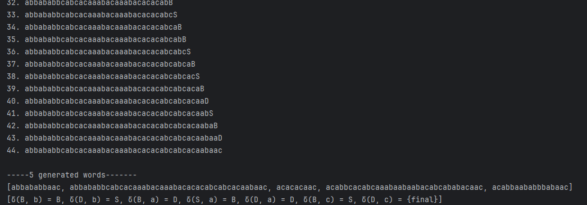
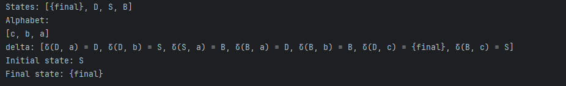
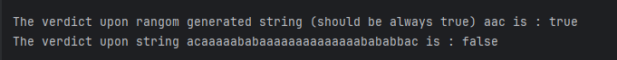

# The title of the work

### Course: Formal Languages & Finite Automata
### Author: Timur Cravțov
### Group: FAF-231

----

## Theory
Grammar is a 4 tuple:
1) V_N - set of non-terminal letters
2) V_T - set of terminal letter
3) P - set of derive rules
4) S - start letter

A grammar with rules in form:
A → aA or A → a is called left-regular grammar can be used to create a finite automata.

Finite automata is a 5 - tuple:
1) Q - set of all possible states, including final
2) Alphabet (denotes as capital sigma letter) - set of Alphabet Symbols
3) Transitions (denoted as delta letter) - set of all transition functions, which maps State + letter to other state (or set of states in NFA)
4) q0 - initial state
5) F - final state

There is a theorem about equivalence of grammar and FA - one can easily be transformed in other. The algorithm Grammar To Finite Automata is described below.


## Objectives:

- Set up the project
- Getting familiar with notions of alphabet, derive rules, grammar, finite automata. 
- Implement algorithm for transforming grammar to FA
- Implement expression validation.


## Implementation description

### Util classes & interfaces

First of all, I'll describe the additional classes I've created:
1) First is `Letter` class, which consists of a String representation of letter and a flag if it's terminal or not. Two methods from `Object` class (`equals`, `hashCode`) were overriden for a better *Set* funcionality.

Since the letter is actually both a state and alphabet symbol, it implements the corresponding interfaces.

```java
// Letter class
public class Letter implements State, AlphabetSymbol {
    private final String letter;
    private final boolean isTerminal;
    ...
}
```

2) Second - `DeriveRule` class. It consists of a List of `Letter`s - from and to. In was told in the presentation that <u>from</u> need to have at least one non-terminal symbol: hence, it means it may be a list. Since neither or variants had more than one symbol in "from" part, the implementation only works with Lists which consists of one letter.

```java
public class DeriveRule {
    private final List<Letter> from;
    private final List<Letter> to;
    ...
}
```

3) `LocalLetterFactory` - we need this for same letter references in different parts of program with no need for using variables.
```java
package md.utm.lab1;

import java.util.ArrayList;
import java.util.HashMap;
import java.util.List;
import java.util.Map;

public class LocalLetterFactory {
    private final Map<String, Letter> letters = new HashMap<>();

    public Letter create(String name, boolean isTerminal) {
        return letters.computeIfAbsent(name, k -> new Letter(name, isTerminal));
    }

    public Letter get(String name) {

        Letter l = letters.get(name);
        if (l == null) {
            throw new RuntimeException(STR."Letter \{name} does not exist");
        }
        return l;
    }

    public List<Letter> getLetterListFromString(String s) {
        List<Letter> letterList = new ArrayList<>();

        for (char ch : s.toCharArray()) {
            letterList.add(get(String.valueOf(ch)));
        }
        return letterList;
    }
}
```

4) Interfaces - `State` and `Alphabet Symbol`. Used for dependency inversion principle. Both have methods `String get...Name()`

### Core classes 
Now, the `Grammar` class. In constuctir we pass all the needed state variables (V_N, V_T, P, S) which are not null;

```java
public Grammar(Set<Letter> V_N, Set<Letter> V_T, Set<DeriveRule> productions, Letter S) {

    if (Stream.of(V_T, V_N, S, productions).anyMatch(Objects::isNull)) {
        throw new RuntimeException("V_T, V_N, S and P should not be null");
    }

    this.V_N = V_N;
    this.V_T = V_T;
    this.P = productions;
    this.S = S;
}
```

Next, the `generateRandomWord()` is defined. The process of generation looks the following way:
1) It generates a string which consists of S:
2) While the string has non-terminal letter, it picks a random letter.
3) Then, it picks a random rule where this letter is in *from* part.
4) Applies the rule, by replacing the picked letter with the *to* part of the rule
5) Repeats
6) The final string is generated (using `Word.makeString(List<Letter>)` method).

```java
import md.utm.lab1.Word;

public String generateRandomString(boolean showProcess) {

    int i = 0;

    if (showProcess) {
        System.out.println(STR."1. \{S}");
    }

    List<Letter> word = new ArrayList<>(List.of(S));
    Random random = new Random();

    while (word.stream().anyMatch(letter -> !letter.isTerminal())) {

        List<Letter> nextGenWord = new ArrayList<>(word);
        List<Letter> finalWord = word; // intelij says you can't use not final in lambda :(

        List<Integer> nonTerminalIndices = IntStream.range(0, word.size())
                .filter(index -> !finalWord.get(index).isTerminal())
                .boxed()
                .toList();

        if (!nonTerminalIndices.isEmpty()) {

            int randomIndex = nonTerminalIndices.get(random.nextInt(nonTerminalIndices.size()));
            Letter randomLetter = word.get(randomIndex);

            List<DeriveRule> possibleRules = P.stream()
                    .filter(rule -> rule.getFrom().getFirst().equals(randomLetter))
                    .toList();

            if (!possibleRules.isEmpty()) {
                DeriveRule selectedRule = possibleRules.get(random.nextInt(possibleRules.size()));

                nextGenWord.remove(randomIndex);
                nextGenWord.addAll(randomIndex, selectedRule.getTo());
            } else {
                throw new RuntimeException(STR."Couldn't find right rule for letter \{randomLetter} adjust your productions or alphabet");
            }
        }

        word = nextGenWord;
        i++;

        if (showProcess) {
            System.out.println(STR."\{i}. \{word.stream().map(Letter::getLetter).collect(Collectors.joining())}");
        }
    }

    return Word.makeString(word);
}

// Word.java

public static String makeString(List<Letter> word) {
    return word.stream()
        .map(Letter::toString)
        .collect(Collectors.joining());
}
```

Before we go to `toFiniteAutomation()` method, first I'll describe the `FiniteAutomation` methods.

The constructor is straightforward.:

```java
public FiniteAutomaton(Set<State> Q, Set<AlphabetSymbol> sigmaAlphabet, Set<Transition> deltaTransitions, State q0, Set<State> F) {
        this.Q = Q;
        this.q0 = q0;
        this.sigmaAlphabet = sigmaAlphabet;
        this.deltaTransitions = deltaTransitions;
        this.F = F;
    }
```

And the transition function is defined by `Transition` because using real functions or maps may be a little tricky.

```java
public Transition(State from, AlphabetSymbol label, State to) {
    this.from = from;
    this.label = label;
    this.to = to;
}
```

Going back to `Grammar`, this is how to convert it to `FiniteAutomata`. Since the constuctor uses interfaces of `Set<State>`, `Set<Letter>` works too. 


```java
public FiniteAutomaton toFiniteAutomation() {

    if (!isRegular()) {
        throw new RuntimeException("The grammar is not regular, can't create finite automata");
    }

    Set<Transition> delta = new HashSet<>();

    // transform rules in transitions
    P.forEach(rule -> delta.add(
            new Transition(
                    rule.getFrom().getFirst(),
                    rule.getTo().getFirst(),
                    rule.getTo().size() == 2 ? rule.getTo().get(1) : Letter.F
            )));

    System.out.println(delta);

    // add to states all the non-terminal plus final
    Set<State> states = new HashSet<>(V_N);
    Set<AlphabetSymbol> alphabet = new HashSet<>(V_T);
    states.add(Letter.F);

    return new FiniteAutomaton(states, alphabet, delta, S, Set.of(Letter.F));
}
```

Now, let's generate 5 random strings and see if a string belongs to finite automata. 

```java
// This part generates grammar

LocalLetterFactory llf = new LocalLetterFactory();

Set<Letter> V_N = Set.of(
        llf.create("S", false),
        llf.create("B", false),
        llf.create("D", false)
);

Set<Letter> V_T = Set.of(
        llf.create("a", true),
        llf.create("b", true),
        llf.create("c", true)
);

Set<DeriveRule> P = Set.of(
        new DeriveRule(llf.get("S"), List.of(llf.get("a"), llf.get("B"))),
        new DeriveRule(llf.get("B"), List.of(llf.get("a"), llf.get("D"))),
        new DeriveRule(llf.get("B"), List.of(llf.get("b"), llf.get("B"))),
        new DeriveRule(llf.get("D"), List.of(llf.get("a"), llf.get("D"))),
        new DeriveRule(llf.get("D"), List.of(llf.get("b"), llf.get("S"))),
        new DeriveRule(llf.get("B"), List.of(llf.get("c"), llf.get("S"))),
        new DeriveRule(llf.get("D"), llf.get("c"))
);

Grammar labOneGrammar = new Grammar(V_N, V_T, P, llf.get("S"));

// Now, 5 strings generated: 

Set<String> words = new HashSet<>();
System.out.println("\n**Generating random strings**\n");

while (words.size() < 5) {
        words.add(labOneGrammar.generateRandomString(true));
}

System.out.println("\n**5 generated words**\n" + words);


// And finally, `toFiniteAutomation` call and string test

FiniteAutomaton finiteAutomaton = labOneGrammar.toFiniteAutomation();
System.out.println("\n**Automaton Test**\n");

String testString = "acacaababababbcacacacaabccccccccaaaac";
String randomString = labOneGrammar.generateRandomString(false);

System.out.println(STR."The verdict upon rangom generated string (should be always true) \{randomString} is : \{DFiniteAutomaton.belongsToAutomation(llf.getLetterListFromString(randomString))}");

System.out.println(STR."The verdict upon string \{testString} is : \{DFiniteAutomaton.belongsToAutomation(llf.getLetterListFromString(testString))}");

```

## Conclusions / Screenshots / Results

### Screenshots


#### 5 generated words:


#### Generated FA:


#### String verification




## References

Regular grammar, Wikipedia - https://en.wikipedia.org/wiki/Regular_grammar
Introduction to Finite automate, geeksforgeeks - https://www.geeksforgeeks.org/introduction-of-finite-automata/
