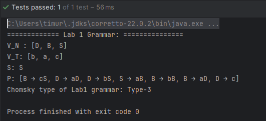
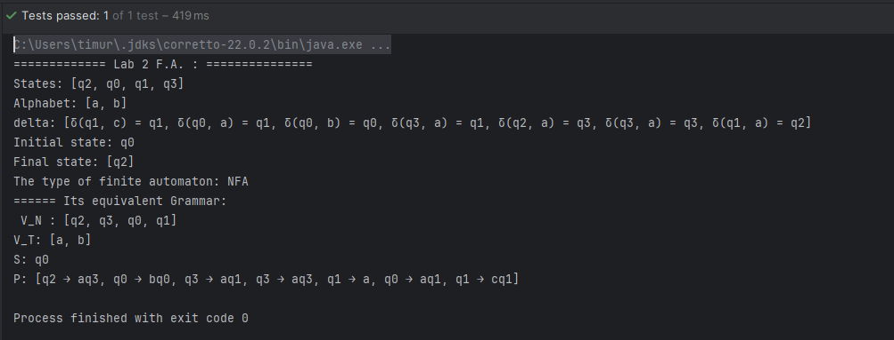
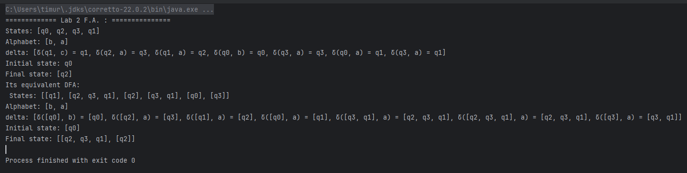
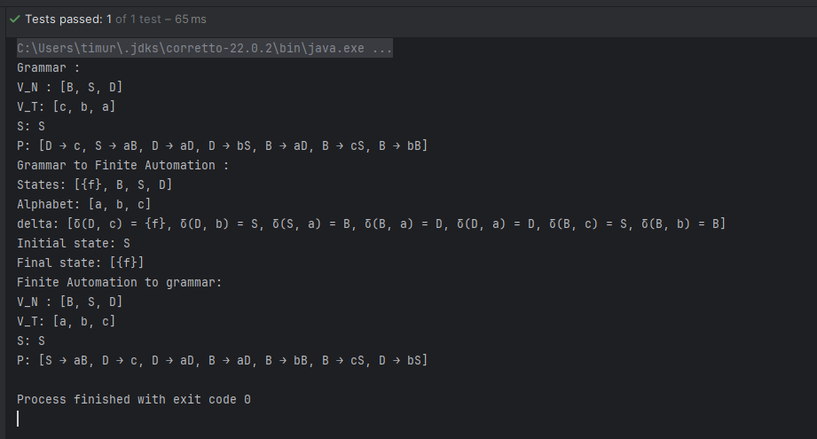
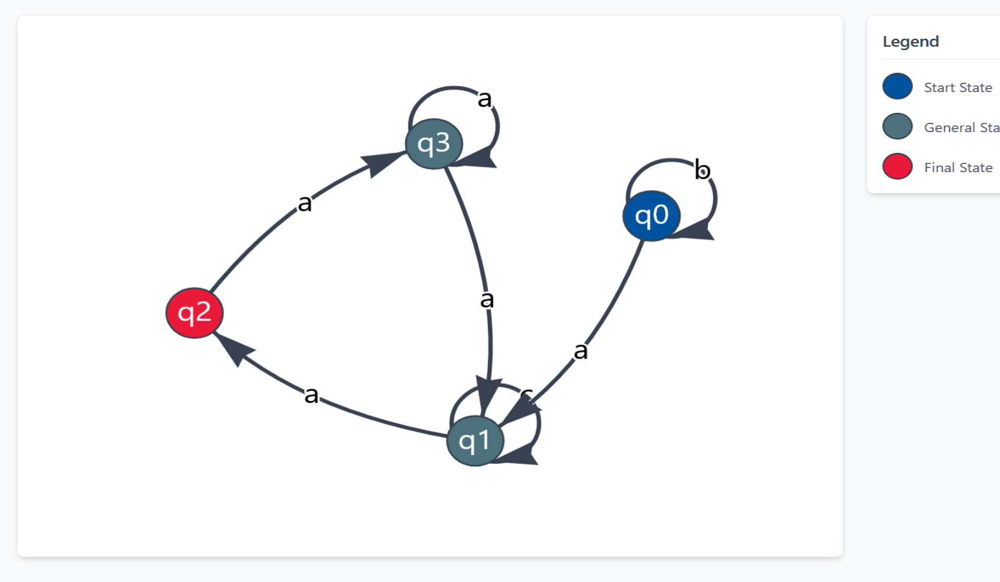

# Determinism in Finite Automata. Conversion from NFA 2 DFA. Chomsky Hierarchy.

### Course: Formal Languages & Finite Automata
### Author: Timur Cravțov
### Group: FAF-231

----

## Theory

### Chomsky classification of Grammar.

Chomsky, an american linguist and professor, suggested a classification of grammar based on the languages it produces.

1) Regular grammar (3rd type)
2) Context-free grammar (2nd type)
3) Context-sensitive grammar (1st type)
4) Unrestricted grammar (0 type)

### Determinism in finity automata

> Determinism - the theory that everything that happens must happen as it does and could not have happened any other way

Based on following definition [^1], it's clear how to separate the deterministic F.A. from Non-deterministic one. NFA, in comparison to DFA, allows transition from same initial state (state + input symbol) to a *set* of possible states, as well as epsilon-transitions. Despite the differences, NFA can be transformed to DFA, preserving the same set of the language defined by them [^2].


### Equivalence of Grammar and FA.

In the last laboratory work, it was mentioned the theorem of the equivalence of Grammar and FA, and there was provided function `toFiniteAutomata()`. In this laboratory work, the inverse function is implemented.

## Objectives:

- Understand what an automaton is and what it can be used for.

- Get the finite automaton definition and do the following tasks:
- Implement conversion of a finite automaton to a regular grammar.
- Determine whether FA is deterministic or non-deterministic.
- Implement some functionality that would convert an NFA to a DFA.
- Represent the finite automaton graphically.


## Implementation description

### Grammar classification

In grammar class, the function `getChomskyType()` is defined.

It works in following way:

1) It filters all the P rules based on whether they have one or more letters.

```java
Predicate<DeriveRule> beforeTransitionOneLetterFilter = rule -> rule.getFrom().size() == 1 && V_N.contains(rule.getFrom().getFirst());
```

2) If `oneLetterFilter` is passed for all the rules, it is either 3rd or 2nd type.

To determine this, we have a regularity filter for each rule:

```java
Predicate<DeriveRule> afterTransitionRegularityFilter = {rule -> ...};
```

And finally, we have another Predicate which checks whether all the rules are either left-regular or right-regular

```java
Predicate<Collection<DeriveRule>> sameRegularitySide = rules -> {...};
```
3) In third step, if we get some productions in which `from` part is not one letter, we produce another filter separating 0 type from 1


```java

for (DeriveRule rule : secondStepMap.get(false)) {
    if (rule.getFrom().size() > rule.getTo().size()) {
        isContextSensitive = false;
        break;
    }
}
        ... 
if (isContextSensitive) return ChomskyType.TYPE1;
else return ChomskyType.TYPE0;
```

### Determining FA type

The summary of `getFiniteAutomationType()`:
1) Iterate through transitions. If there is one epsilon-transition (label is epsilon), it's NFA
2) Create a HashMap of `{state}:{label}`. If during the adding of new key of the transition, the key is already present, it means it's NFA
3) If none of the above happened during the iterations, it's DFA


### NFA to DFA conversion

The conversion of NFA to DFA follows the common algorithm:

1) Defining the q0 of DFA as set of epsilon-closure of NFA's q0

```java
ObjectState<HashSet<State>> dfaQ0 = new ObjectState<>(new HashSet<>());
            dfaQ0.getObject().add(this.q0);
            dfaQ0.getObject().addAll(getEpsilonClosure(this.q0));
```
2) Finding the states reachable in NFA from current DFA state
```java
for (State nfaState : currentDfaState.getObject()) {
    nextNfaStates.addAll(this.getNextStates(nfaState, symbol));
}
```

3) For this NFA states, add in new DFA state the set of union of sets of epsilon closure of them. (too much sets)

```java
Set<State> nextDfaStateSet = new HashSet<>();
for (State state : nextNfaStates) {
    nextDfaStateSet.addAll(getEpsilonClosur(state));
}
```
4) Continue processing the states until the queue is empty
5) The set of final states - is a set of all DFA states which contain final state of initial NFA.

```java
Set<ObjectState<HashSet<State>>> dfaFinalStates = dfaStates.stream()
        .filter(state -> state.getObject().stream().anyMatch(F::contains))
        .collect(Collectors.toSet());
```

### F.A. to Regular Grammar:

Again, it follows the common algorithm:

1) `V_T` is the set of alphabet of NFA
2) `V_N` is the set of all states in NFA but the {final} state superficially added to convert Grammar to NFA
3) Transition mapping of `δ(A, b) = C`:
   - Is converted to `A -> b` if C is a final state:
   - `A -> bC` otherwise
  
4) `q0` is mapped to `S`


### Visualization

For Finite Automata visualization, `vis.js` library in Javascript was used. It's primarily used for graph visualization, but with certain legend definition, can be used for visualization of FA. `visualize()` function created a `data.json` file, which contains, basically, the graph definition. In `script.js` this data is adjusted for compatability with the library. `index.html`, opened by the program, displays the data.

## Conclusions / Screenshots / Results

### Screenshots

#### Chomsky classification of lab 1 grammar:



This screenshot proves that the grammar is regular

#### Finite automation type and it's grammar equivalent:



#### NFA to DFA conversion



#### Grammar to FA, FA to Grammar black



This test has proven the equivalence of FA and Grammar.

#### Visualization of Lab2 NFA




### Conclusions

The objectives of the laboratory work were reached.

Based on previously created classes, I've implemented a set of util functions which enriches their use: 

1) `getChomskyType()` of `Grammar` class;
2) `toGrammar()` of `FiniteAutomata` class
3) `getFiniteAutomataType()` of `FiniteAutomata` class 
4) `visualize()` for `FiniteAutomata` class

Additionally, I want to thank the creators of OOP paradigm, since all the classes are as reusable as possible. 

The functions mentioned are as generic as possible. They can be used for any type of input data. In case if mistakes are made (eg. attempt of conversion of Non-regular grammar to FA), exception are thrown. 

These functions can be further improved for better usability. The classes, such as `DeriveRule`, can override core `equals` method for a better comparison of rules, production set or even Grammar as whole. 


## References

[^1]: Definition of determinism https://dictionary.cambridge.org/dictionary/english/determinism

[^2]: Lecture notes

[^3]: NFA to DFA conversion, GeeksForGeeks https://www.geeksforgeeks.org/conversion-from-nfa-to-dfa/

