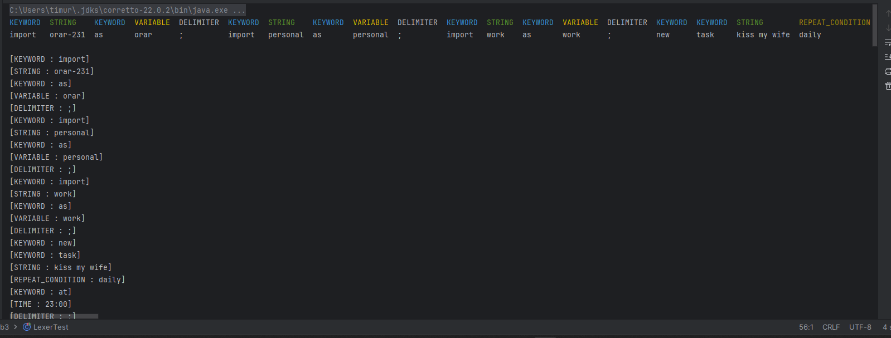
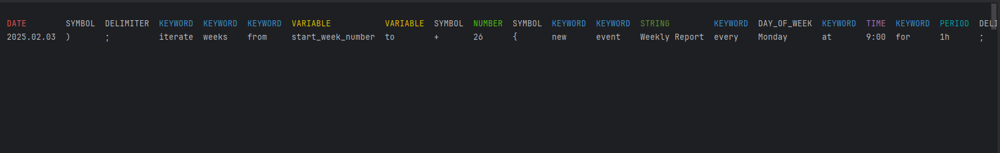

# Lexer & Scanner

### Course: Formal Languages & Finite Automata
### Author: Timur Cravțov
### Group: FAF-231

----

## Theory

Lexer / Scanner are one of the core functionality in compiler design. The Lexer aka Scanner, is responsible for dividing the input string of characters into tokens, aka *Lexemes*.

Lexer can be represented as stream of lexemes. Each lexeme has its type and, possibly, value. E.g: In a string `... while (a <= b) ...` while can be treated as `keyword` with value `while`, `a` and `b` - `variable`s with corresponding values, and `<=` as `mathematical condition`. 

So, a Lexer is not only responsible for splitting the string by some delimiters such as spaces or `;`, but also providing lexical analysis which includes determining the actual type of that token.


## Objectives:

- Understand what lexical analysis [1] is.
- Get familiar with the inner workings of a lexer/scanner/tokenizer.
- Implement a sample lexer and show how it works.

## Implementation description

The `AionLexer` class provides `tokenize` function for `.aion` files. Aion [^1] is a DSL that is being developed during current semester at PBL course, which manages `.ics` files. Since Aion language is still under development, the used `sample.aion` and `simple.aion` files might not represent the latest Aion grammar rules or possible token types. 

The Token types defined by the language are the following:

```java
public enum TokenType {
    DAY_OF_WEEK, DATE, TIME, NUMBER, STRING, KEYWORD, SYMBOL, OPERATOR, VARIABLE, DELIMITER, PERIOD, REPEAT_CONDITION, MONTH, COMPARISON_CONDITION,
}
```

As already mentioned, each `Token` has a type and, optionally, value.  

```java
public class Token {
    private TokenType type;
    private String value;
    // ...
}
```

### Tokenization description

This section will describe the algorithm of tokenization.

1) Firstly, we define the keywords-

- Keywords really used as keywords, like syntax keyword:
```java
private static final Set<String> KEYWORDS = Set.of(
"import", "as", "calendar", "event", "default" /*,  ...  */ );
```

- Days of the Week names and their shortcuts:

```java
private static final Map<String, Set<String>> DAYS_OF_WEEK_VARIATIONS = Map.of(
            "Monday", Set.of("Monday", "Mon", "M") /*, ... */);
```

- Month names and their shortcuts:
```java
 private static final Map<String, Set<String>> MONTHS_VARIATIONS = new HashMap<>() {{
        put("January", Set.of("January", "Jan")) /*, ... */; }};
```

- Repeat timeframes

```java
private static final Set<String> REPEAT_CONDITIONS = Set.of("daily", "weekly", "monthly", "yearly");
```

2) Next step, we define the matching patters using build-in `Regex` pattern finders. To name a few, we have defined:

- `DATE_PATTERN`: `"\\d{4}.\\d{1,2}.\\d{1,2}"`
- `TIME_PATTERN`: `\d{1,2}:\d{2}`
- `VARIABLE_PATTERN`: `[a-zA-Z_][a-zA-Z0-9_]*`

... and other

3) Then, we start iterate through the input. On each step, we try to match the substring `[currentposition: length)` to each of the defined Regex. If one look-up if found (E.g. we see a substring `13:40 March ...`) extract add in Token List new `Token(TokenType.TIME, 13:40)`, and move the cursor to the length of the found substring (in this example, `5`).
4) If in input stream some unknown keyword is found, it is though as a variable. For instance, if somebody misspelled `Wendzeday`, it is gonna be considered variable.
5) Since the variables can be only alphanumeric with underscores, not all the non-keyword token values are accepted. If a token starts with some special symbol (E.g. `$some_php_variable`), the tokenizer is going to throw an exception.

For example, this is a part of iteration over the input string, where `pos` is the current "cursor" position

```java
// Extract period in form 2h
Matcher periodMatcher = PERIOD_PATTERN.matcher(input.substring(pos));
if (periodMatcher.lookingAt()) {
    tokens.add(new Token(TokenType.PERIOD, periodMatcher.group()));
    pos += periodMatcher.group().length();
    continue;
}
```

## Conclusions / Screenshots / Results


### Screenshots 
Tokenization of `sample.aion` file:

1) First screenshot, the initial result. In the first line the types of tokens from the second like. In the bottom, each Token is displayed with its type and value.



2) Some additional token types not seen in screenshot below.



### Conclusions

During this laboratory work, I killed two birds with one stone, developing Lexer for `Aion` language. 

I defined Token Types which work with basic date formats; Then, I defined a `Map` of days of the week and their shortcuts; same thing with Months. Then, a regex-based `Pattern`s were defined for classifying the current string input. 

Using all of this structures, i iterated over [sample.aion](../src/main/java/md/utm/lab3/resources/sample.aion) file and extracted the tokens. The output proved that it works as intended.

[^1]: Aion website https://aion-ics.github.io/ (might not be done until the end of the semester)

[^2]: Introduction to Finite automate, geeksforgeeks -

[^3]: Lecture notes
