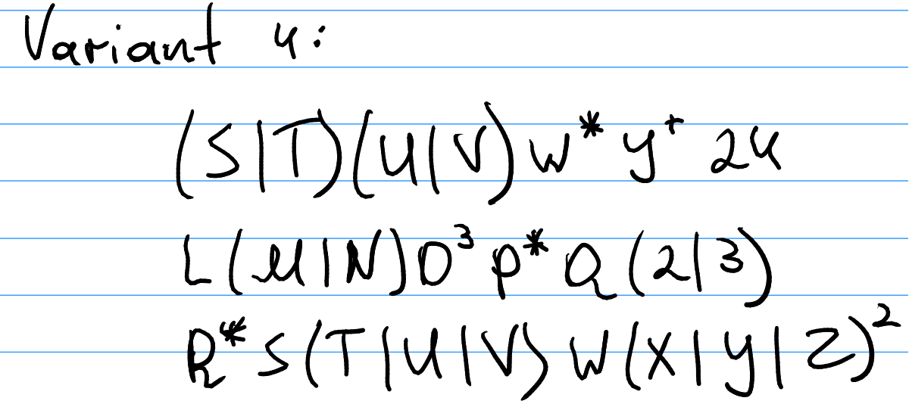
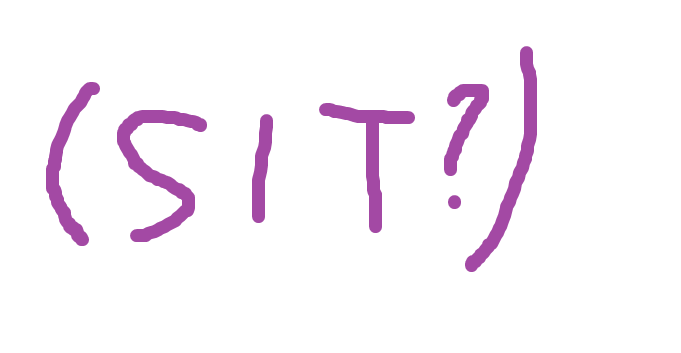
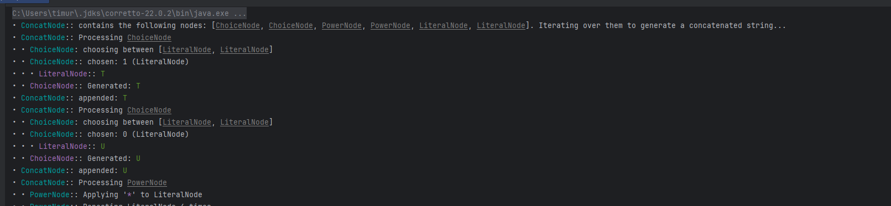
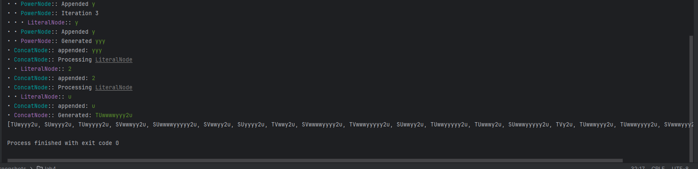
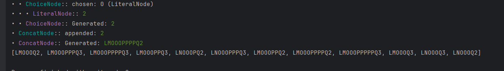
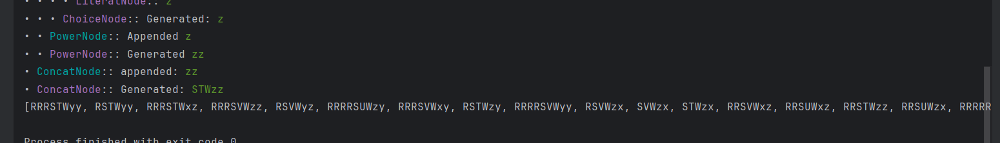

# Regular Expressions

### Course: Formal Languages & Finite Automata
### Author: Timur Cravțov
### Group: FAF-231

----

## Theory

Regular expressions [^1] is an algebraic description of Finite Automata. 

Regular expression over and alphabet is an expression which is formed using following rules:

1) The empty set and epsilon are regular expression
2) Every symbol in alphabet is regular expression
3) If *R* and *S* are regular expressions, so are *R + S*, *RS* and *R**

Regular expressions have different applications:

1) In Science of Finite Automata it is used to determine whether the language is regular. So, if we can find a Regular expression for the language, it can be classified as regular, and DFA or NFA can be created based on it.
2) In real-word applications, Regex are used for pattern matching within a string. For instance, in validation of user emails in form `username@exaple.org`. In previous laboratory work [^2], Regexes were used for tokenization, determining its type based on the regex there are matched (`TIME_PATTERN`, `DATE_PATTERN`, etc)
3) Also regex are powerful tool in string search, not only validating it. 
4) Regex [^3] matchers are available in any major programming languages, suggesting its application in different areas.

## Objectives:

1) Write and cover what regular expressions are, what they are used for;

2) Below you will find 3 complex regular expressions. Do the following:

   1) Write a code that will generate valid combinations of symbols conform given regular expressions.

   2) In case you have an example, where symbol may be written undefined number of times, take a limit of 5 times (to evade generation of extremely long combinations);

   3) Bonus point: write a function that will show sequence of processing regular expression (like, what you do first, second and so on)




## Implementation description

The given in the task regular expressions were manually converted into hierarchy on nodes. The base node, each other are extend, is `RegexNode`

```java
public abstract class RegexNode {
    public abstract String generate(boolean reasoning, int level);
}
```

The `generate()` function will be overriden in each child of `RegexNode`.
The `reasoning` argument is the flag whether to provide detailed step by step generation of output. `level` is used for increasing ident in child nodes. In case user wants to have the steps printed beautifully.  

I've generated a couple of `RegexNode`s:

1) `ChoiceNode`. It has an input of other `RegexNode`s. If called `generate()`, it picks a random node, and returns it's `generate()` result.


```java
public class ChoiceNode extends RegexNode {

    private final List<RegexNode> nodes;
    // ...
}
```

2) `ConcatNode`. Iterates through the children nodes and appends their `generate()`. Result. In the end, returns the concatenated string.

```java
public class ConcatNode extends RegexNode {
    private final List<RegexNode> children;
    // ... 
}
```
3) `PowerNode` - is a node in a form of `A^n`, where n can be either `*`, `+` and any other name. When its `generate()` is called, it iterates `n` times, appending the result of `generate` of the child node

```java
public class PowerNode extends RegexNode {
    private final RegexNode node;
    private final String power;
    // ... 
}
```

4) `QuestionNode` - generatess the child's output if `randboolean` gives true. Otherwise, skips.

```java
public class QuestionNode extends RegexNode {
    private final RegexNode node;

    // ... 
}
```

5) Finally, `LiteralNode`. Simply returns the literal. 

```java
public class LiteralNode extends RegexNode {
    private final String literal;
    // ...
}
```

The example hierarchy may look like:

```java
 RegexNode n = new ChoiceNode(
                new LiteralNode("S"),
                new QuestionNode(
                        new LiteralNode("T")
                )
        );
```

Its equivalent regex is:



## Conclusions / Screenshots / Results

### Screenshots

The generated expressions for 1st Regex:






The generated expressions for 2nd Regex:




The generated expressions for 3rd Regex:




### Conclusions

During this laboratory work, I implemented a random regex string generation, It has a recursive hierarchy consisting of nodes `QuestionNode`, `ConcatNode`, `ChoiceNode`, `QuestionNode`, `LiterNode`. The program gracefully prints the random strings which satisfy the Regex. 

## References

[^1]: Lecture Notes

[^2]: LAB-3_LFA_Timur-Cravtov.md

[^3]: Java Regex - https://www.w3schools.com/java/java_regex.asp
