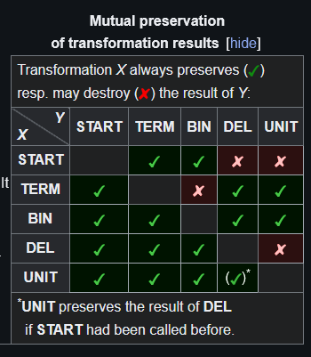
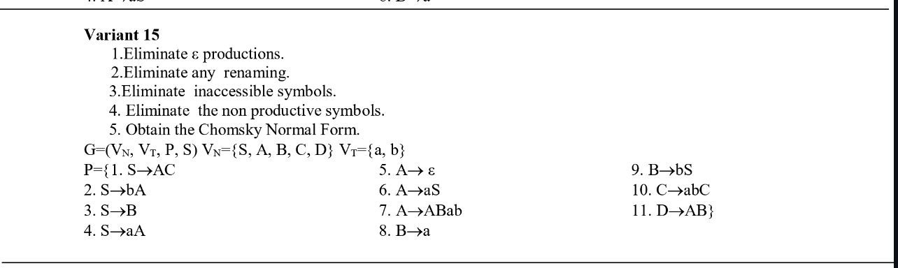
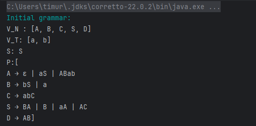
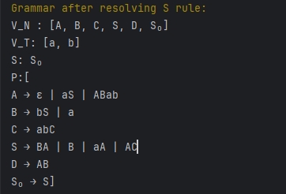

# Chomsky Normal Form

### Course: Formal Languages & Finite Automata
### Author: Timur Cravțov
### Group: FAF-231

----

## Theory

Chomsky Normal Form [^1] is a special form of Grammar where all the rules are in one of the following format: 

1) _A -> BC_
2) _S -> ε_, if S is the starting symbol
3) _A -> a_

Chomsky Normal Form is usually used to simplify Context Free Grammar (Type 2, CFG). The key advantage is that in Chomsky Normal
Form, every derivation of a string of n letters has
exactly 2n − 1 steps [^2].

Here is the steps of converting a Grammar to Chomsky Normal Form:

0) If *S* symbol is met in RHS, then we create a new starting state (typically called *S0*) and make a transition *S0 -> S*.

1) Eliminate ε-transitions. In case there is A -> ε, it is considered a nullable. if a non-terminal in RHS has all the letters nullable, it is nullable as well (E.g. if in *B -> ACDE*, *A*, *C*, *D*, *E* are nullables, B is nullable). When nullables is defined, in each production in form *A -> BCDaE*, we add a set of all possible productions, where the nullable is absent. E.g.: if *B* and *D* and *E* are nullable, then we create a 2<sup>3</sup> new productions: B -> BCaE | BCDa | CDaE | CDa | ... | Ca.
2) Eliminate Unit productions. For all productions if form *A -> B*, replace this production in *A -> {set of production (except unit) of the grammar with B in LHS}*
3) Split long productions. If we have *A -> bCD*, replace it with *A -> bE* \*, and add production *E -> CD*
4) After the 3rd step, only production which needs fix are *A -> bC*. Replace them with *A -> BC* and add *B -> b*

\* Of course, if the letter E or other is already used in the Grammar, need to replace it with some unique one. In the lab, `VariableFactory` class serves this purpose.

The obtained Chosmky Normal Form is not unique for the Grammar. One can define either different variables for holding intermediate states, or use different algorithm of grouping the terms. But in the end, the obtained Grammar is equivalent to the initial Grammar, which means, It can describe the same set of words. 

## Objectives:

1) Learn about Chomsky Normal Form (CNF)

2) Get familiar with the approaches of normalizing a grammar.

3) Implement a method for normalizing an input grammar by the rules of CNF.

## Implementation description

Here is step-by-step process of CNF-service work:

1) Creates rule S -> S0 if needed

```java
public void resolveStartingSymbol() {
    if (hasSOnRight(grammar.getS(), grammar.getP())) {
        Letter newStart = variableFactory.getNewStartLetter();
        this.grammar.getP().add(new DeriveRule(newStart, grammar.getS()));
        this.grammar.setS(newStart);
        this.grammar.getV_N().add(newStart);
    }
}
```

This function uses `hasSOnRight()` method which takes iterates trough production rules and, if there is one, sets new Starting symbol and adds it to V_N

2) Eliminate epsilon transitions.

```java
public void eliminateEpsilonTransitions() {
        // ... 
        Set<Letter> nullables = extractNullables();
        newRules.removeIf(this::isNullTransition);
        // ... 

        for (DeriveRule rule : grammar.getP()) {
            // .. 
            Set<List<Letter>> combinations = generateNullableCombinations(rhs, nullableIndexes);
            // ..
           DeriveRule newRule = new DeriveRule(rule.getFrom(), combination);
                generatedRules.add(newRule);
        }
        // ...
    }
```

This method extracts nullabes (already explained in Theory part what nullable is, and then adds to rules new ones with all the combinations with nullable removed)

3) Replace long production with short ones (E.g. A -> bCD to {A -> bE, E -> CD})

```java
public void replaceLongProductions() {
    for (DeriveRule rule : grammar.getP()) {
      HashSet<DeriveRule> eachStepNewRules = new HashSet<>();
      shortify(rule, eachStepNewRules);
      newProductions.addAll(eachStepNewRules);
   }
   grammar.getP().removeIf(rule -> rule.getTo().size() > 2);
   grammar.getP().addAll(newProductions);
}
```
It uses the recursive method `shortify()`, which recursively makes productions shorter and adds new rules. For examples, if we have production (A -> BCDE), it creates A -> BH, and simplifies H -> CDE. It creates H -> CI, and adds I -> DE. DE is already small, so it is added to final set of productions.

4) Replaces all terminals with non-terminals

```java
public void replaceTerminalsWithIntermediate() {
    
   for (DeriveRule rule : grammar.getP()) {

      // ...
      for (int i = 0; i < MAX_NON_TERMINAL_COUNT; i++) {
          // .. 
          Letter newNonTerminal = replaceWithNonTerminal(letter);
          this.grammar.getV_N().add(newNonTerminal);
          newRules.add(new DeriveRule(newNonTerminal, List.of(letter)));
      }
   }
   // ...
}
```

This method is pretty straight forward.If the lenght of the RHS of a rule is 2, it might have either A -> bC or A -> bc, rules which need to be fixed. So, for each terminal we create a new letter, and create a rule Terminal -> Non-terminal. (E.g. A -> EC, E -> b). In the end, all the rules are updated.

5) Simplification of the rules. 

This is done in two steps:

a) Removing inaccessible from S states

b) Remove repetitions. In previous steps, a bunch of new states were introduced. There are states which lead to same set of symbol. E.g. we have (A -> {b}, C -> {b}). Having 2 same states is redundant, so we leave only one, and replace the deleted state with picked one in all possible rules.

*Finally*, a CNF is obtained

> Note: Each step can be done separately and in a couple of different orders.

The image below [^3] demonstrates the relations between method call order and destroying of the transformations.



One can see, that there is some restrictions on order of operations. In current work implementation, all the intermediate transformation methods were mede `public` for testing purpose only. Each changes the `grammar` reference inside `CNFService` class. For general purpose, `normalize()` method of `CNFService`  is developed, where the mentioned methods (transformations) are called in one the accepted orders.

## Conclusions / Screenshots / Results

The 12th variant grammar:




### Screenshots

1) Initial grammar



2) As one can notice, there are multiple productions which have *S* in RHS (E.g. *A -> aS*). Hence, we create a rule $S_0\rightarrow  S$, and add $S_0$ in $V_n$




### Conclusions

## References

[^1]: Lecture Notes

[^2]: Clemson univesity, Chomsky normal form. https://people.computing.clemson.edu/~goddard/texts/theoryOfComputation/9a.pdf

[^3]: Wikipedia. Chomsky normal form. https://en.wikipedia.org/wiki/Chomsky_normal_form
