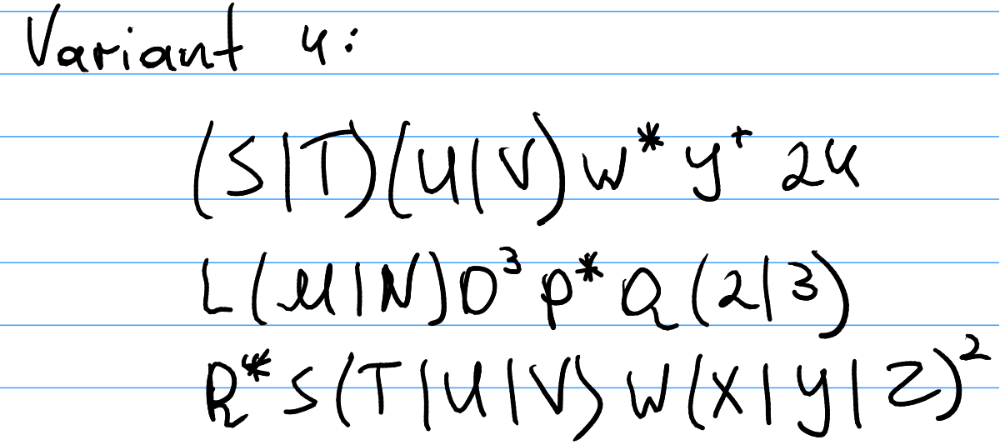
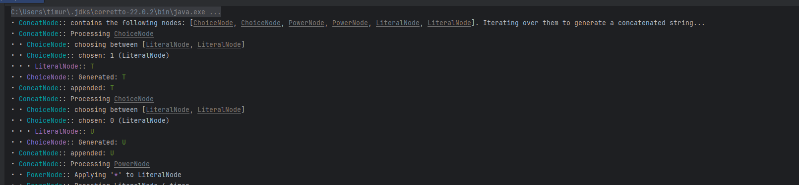
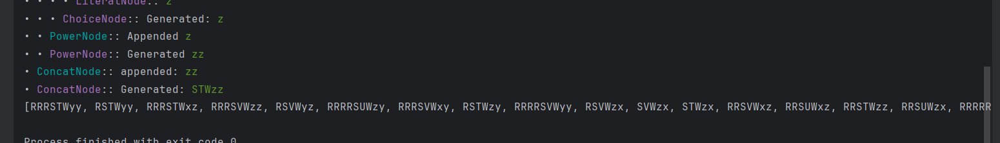

# Chomsky Normal Form

### Course: Formal Languages & Finite Automata
### Author: Timur Cravțov
### Group: FAF-231

----

## Theory

Chomsky Normal Form is a special form of Grammar where all the rules are in one of the following format: 

1) _A -> BC_
2) _S -> ε_, if S is the starting symbol
3) _A -> a_

Chomsky Normal Form is usually used to simplify Context Free Grammar (Type 2, CFG). The key advantage is that in Chomsky Normal
Form, every derivation of a string of n letters has
exactly 2n − 1 steps [^2].

Here is the steps of converting a Grammar to Chomsky Normal Form:

0) If *S* symbol is met in RHS, then we create a new starting state (typically called *S0*) and make a transition *S0 -> S*.

1) Eliminate ε-transitions. In case there is A -> ε, it is considered a nullable. if a non-terminal in RHS has all the letters nullable, it is nullable as well (E.g. if in *B -> ACDE*, *A*, *C*, *D*, *E* are nullables, B is nullable). When nullables is defined, in each production in form *A -> BCDaE*, we add a set of all possible productions, where the nullable is absent. E.g.: if *B* and *D* and *E* are nullable, then we create a 2<sup>3</sup> new productions: B -> BCaE | BCDa | CDaE | CDa | ... | Ca.
2) Eliminate Unit productions. For all productions if form *A -> B*, replace this production in *A -> {set of production (except unit) of the grammar with B in LHS}*
3) Split long productions. If we have *A -> bCD*, replace it with *A -> bE* \*, and add production *E -> CD*
4) After the 3rd step, only production which needs fix are *A -> bC*. Replace them with *A -> BC* and add *B -> b*

\* Of course, if the letter E or other is already used in the Grammar, need to replace it with some unique one. In the lab, `VariableFactory` class serves this purpose.

## Objectives:

1) Write and cover what regular expressions are, what they are used for;

2) Below you will find 3 complex regular expressions. Do the following:

   1) Write a code that will generate valid combinations of symbols conform given regular expressions.

   2) In case you have an example, where symbol may be written undefined number of times, take a limit of 5 times (to evade generation of extremely long combinations);

   3) Bonus point: write a function that will show sequence of processing regular expression (like, what you do first, second and so on)




## Implementation description

The given in the task regular expressions were manually converted into hierarchy on nodes. The base node, each other are extend, is `RegexNode`

```java
public abstract class RegexNode {
    public abstract String generate(boolean reasoning, int level);
}
```

The `generate()` function will be overriden in each child of `RegexNode`.
The `reasoning` argument is the flag whether to provide detailed step by step generation of output. `level` is used for increasing ident in child nodes. In case user wants to have the steps printed beautifully.  

I've generated a couple of `RegexNode`s:

1) `ChoiceNode`. It has an input of other `RegexNode`s. If called `generate()`, it picks a random node, and returns it's `generate()` result.


```java
public class ChoiceNode extends RegexNode {

    private final List<RegexNode> nodes;
    // ...
}
```

2) `ConcatNode`. Iterates through the children nodes and appends their `generate()`. Result. In the end, returns the concatenated string.

```java
public class ConcatNode extends RegexNode {
    private final List<RegexNode> children;
    // ... 
}
```
3) `PowerNode` - is a node in a form of `A^n`, where n can be either `*`, `+` and any number. When its `generate()` is called, it iterates `n` times (for `*` and `+` it picks a number from `[0,6]` and `[1, 5]` respectively) , appending the result of `generate` of the child node

```java
public class PowerNode extends RegexNode {
    private final RegexNode node;
    private final String power;
    // ... 
}
```

4) `QuestionNode` - generates the child's output if `randboolean` gives true. Otherwise, skips.

```java
public class QuestionNode extends RegexNode {
    private final RegexNode node;

    // ... 
}
```

5) Finally, `LiteralNode`. Simply returns the literal. 

```java
public class LiteralNode extends RegexNode {
    private final String literal;
    // ...
}
```

The example hierarchy may look like:

```java
 RegexNode n = new ChoiceNode(
                new LiteralNode("S"),
                new QuestionNode(
                        new LiteralNode("T")
                )
        );
```

Its equivalent regex is:

<div align="center">
<code>
(S | T?)
</code>
</div>


## Conclusions / Screenshots / Results

### Screenshots

The generated expressions for 1st Regex:




The generated expressions for 2nd Regex:


The generated expressions for 3rd Regex:




### Conclusions

During this laboratory work, I implemented a random regex string generation, It has a some sort of recursive hierarchy consisting of nodes `QuestionNode`, `ConcatNode`, `ChoiceNode`, `QuestionNode`, `LiterNode`. The program gracefully prints the random strings which satisfy the Regex. 

## References

[^1]: Lecture Notes

[^2]: Clemson univesity, Chomsky normal form. https://people.computing.clemson.edu/~goddard/texts/theoryOfComputation/9a.pdf
