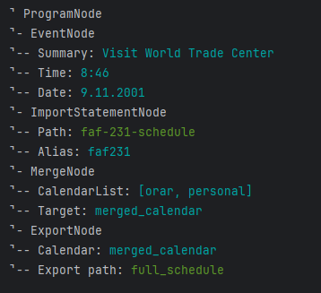

# **Parser & Abstract Syntax Tree Construction: Parsing and Syntax Analysis**

### Course: Formal Languages & Finite Automata

### Author: Timur Cravtov

### Group: FAF-231

---

## **Theory**

Parsing is a crucial process in both programming language implementation and text analysis. It is the technique used to analyze and extract syntactic information from a sequence of symbols, often resulting in a parse tree that represents the hierarchical structure of the input. In programming languages, the parsed information is further used to generate intermediate representations such as abstract syntax trees (ASTs).

An Abstract Syntax Tree (AST) is a simplified, abstract representation of a parse tree. Unlike the parse tree, which retains all syntactic information (including punctuation and grammar rules), the AST focuses on the essential structure and ignores unnecessary details. It is often used as an intermediate representation in compilers and interpreters for subsequent phases such as semantic analysis, optimization, and code generation.

In this context, the lab focuses on implementing a parser that extracts the syntactic information of an input text and constructs an AST. The approach involves defining a type system for tokens, implementing a tokenizer (lexer), and then utilizing a recursive-descent parsing method to process the structured text.

---

## **Objectives**

The objectives of this lab were twofold: to gain practical experience in syntactic analysis by parsing an input and constructing an Abstract Syntax Tree (AST), and to apply these concepts in a concrete scenario. Specifically, the lab aimed to:

1. Implement a parser that uses tokenization and lexical analysis to categorize tokens.
2. Design an Abstract Syntax Tree (AST) structure to represent the syntactic elements processed by the parser.
3. Develop a recursive-descent parser to extract syntactic information from a calendar DSL (Domain-Specific Language), based on an earlier lab's lexer implementation.

---

## **Implementation Description**

The system was implemented using C# under the .NET 9 platform, following a modular architecture. The key components included a **TokenType** enum for categorizing tokens, a lexer to tokenize the input text, and a parser that generates an Abstract Syntax Tree (AST).

### **Lexer and Tokenization**

The first step in the process involved defining a `TokenType` enum to categorize the various tokens that could be encountered during the analysis. The tokenizer uses regular expressions to identify and classify tokens, such as keywords (e.g., `import`), literals (e.g., strings, numbers), and operators. The lexer processes the input text character by character, collecting and categorizing tokens accordingly. Here's an example of how tokens are recognized:

```
TokenType.Import -> 'import'
TokenType.String -> 'personal.ics'
TokenType.Identifier -> 'personal'
```

### **Parser and Abstract Syntax Tree**

After tokenizing the input, the next step was to parse the tokens into a structured format. The parser follows a recursive-descent approach, where each non-terminal in the grammar is associated with a function that attempts to match the input text to its expected structure. The parser works by consuming tokens from the stream and building an AST based on predefined grammar rules.

The grammar for the calendar DSL includes constructs for defining events, tasks, and pomodoros, as well as directives like `import`, `merge`, `filter`, and `export`. Below is a simplified example of the AST for a sample calendar DSL input:

```text
⌝ ProgramNode
⌝- EventNode
⌝-- Summary: Visit World Trade Center
⌝-- Time: 8:46
⌝-- Date: 9.11.2001
⌝- ImportStatementNode
⌝-- Path: faf-231-schedule
⌝-- Alias: faf231
⌝- MergeNode
⌝-- CalendarList: [orar, personal]
⌝-- Target: merged_calendar
⌝- ExportNode
⌝-- Calendar: merged_calendar
⌝-- Export path: full_schedule
```

This structure represents a calendar program that includes event definitions, assignments, and imports. Each node in the AST corresponds to a syntactic unit such as a statement, an event, or an assignment.

### **Recursive-Descent Parser Implementation**

The recursive-descent parser is designed to process the calendar DSL line-by-line, with specific functions for parsing events, tasks, and other constructs. The parser uses the token stream produced by the lexer and recursively matches the expected grammar for each construct.

For example, the parser for an event would look for the `event` keyword, followed by the event name, start time, duration, and location. Similarly, for loops and conditionals, the parser identifies the relevant keywords (`each`, `if`, `else`) and ensures that the corresponding blocks are correctly parsed and represented in the AST.

---

## **Results and Analysis**

The implementation successfully processes calendar DSL inputs into an Abstract Syntax Tree (AST), ensuring that all events, tasks, and other constructs are accurately represented. The parser is capable of handling various constructs such as:

* **Inline Events**: These represent specific occurrences of events, such as a meeting or a task at a particular time.
* **Looping Constructs**: These define recurring events or tasks, such as "every Monday" or "each month from January to March."
* **Conditional Constructs**: These handle conditional scheduling based on certain conditions, such as scheduling a task only if the count of Fridays in a given month is equal to 4.

Here’s an example input and its corresponding AST output:

**Input:**

```text
new event "Visit World Trade Center" at 8:46 on 9.11.2001;
import "faf-231-schedule" as faf231;
merge orar, personal into merged_calendar;
export merged_calendar as "full_schedule";
```

**AST Output:**



The parser correctly identifies all tokens, processes them according to the grammar, and generates the expected AST structure.

---

## **Conclusion**

This lab successfully demonstrated the process of building a parser and constructing an Abstract Syntax Tree (AST) from a domain-specific language (DSL) designed for event scheduling. By implementing a recursive-descent parser and employing a tokenization system, the lab provided practical insights into syntactic analysis and the creation of hierarchical structures such as ASTs. The system is modular, extensible, and capable of processing various DSL constructs with ease.

The implementation of the **TokenType** enum and the lexer ensures efficient token categorization, while the parser efficiently handles complex constructs such as events, tasks, loops, and conditionals. This approach aligns with modern compiler design techniques and can be extended to handle more complex grammars and features in the future.

---

## **References**

* **John E. Hopcroft & Jeffrey D. Ullman** – *Introduction to Automata Theory, Languages, and Computation*
* **Michael Sipser** – *Introduction to the Theory of Computation*
* Formal Languages & Finite Automata Course Materials, UTM